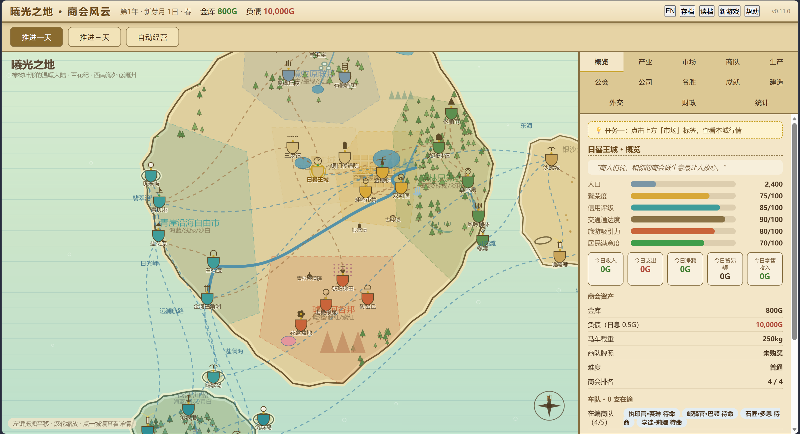

# 曦光之地 · 商会风云（Dawnlands · Merchant Chronicle）


> 一款**零依赖、双击即玩**的网页经营模拟游戏：从「曦光之地」六国二十二城、海外新大陆苍澜洲与银沙大岛中选一座城市起步，经营十年，把它变成全大陆最繁荣的商都。
> 纯 HTML/CSS/JS 编写，无框架、无构建、无联网需求，用任意现代浏览器打开 `index.html` 即可开始。

## 🎮 在线试玩

部署到 GitHub Pages 后，访问：

**https://\<你的用户名\>.github.io/\<仓库名\>/**

（将上面两个尖括号占位符换成你自己的信息；也可以完全不用在线版——直接把仓库下载下来双击 `index.html` 就能玩。）

## 📸 截图



## ✨ 玩法特色

- **地图**：曦光之地 + 苍澜洲双大陆、39 座城镇、岛屿与远洋航线；锯齿海岸、多条河流、农田与葡萄园、森林树丛、海角灯塔与各城专属地标；商路为自然曲线，左键拖拽平移、滚轮缩放，点击城镇可查看详情并派商队
- **市场生态**：本地流通市场的货不属于玩家——从居民摊位或外地商队手里买入进仓库；仓库的货可卖给居民（自己定价）、卖给在镇外地商队或装车外销；外地需求分「公告」与「打听」两类，酒馆/旅店/驿站带来更多情报
- **商队经营**：每座城市有自己的商队负责人（2~4 人，名字与特长各异）；商队可升级载重与速度；维护费仅在途收取；途中可能遇到路边商贩高价收购，也可遭遇强盗劫掠或海盗
- **生产与产业**：生产工坊（麦酒/葡萄酒/帆布/香料/鲸蜡/木雕/铜器/果干/粗制面包等配方）+ 酿酒坊/织造坊/烘焙坊/酒馆/服装店/糕点铺产业链；成品品质 = 原料品质（葡萄酒至少精良）
- **公司与股份**：各城围绕特产开设公司，港口另有航运公司；股价随真实经营浮动；持股 ≥10% 可开董事会定方针，≥30% 可提议增发，≥51% 可溢价收购控股
- **竞争商会**：三支 NPC 商会在全大陆真实经商——套利囤货、抢你的采购大单、响应你的出售公告，还会避开你垄断的商路
- **冒险与事件**：强盗/海盗可开关；冒险者公会雇佣护卫、剿灭强盗、养成升级；多步事件链（护卫商队、金穗领饥荒、商会暗斗）带来小剧情
- **节日与名胜**：6 个节日各有可参与活动；派探险队发现名胜，投资开发收门票（也要付维护费）
- **外交与财政**：与 22 城的关系值、通商条约、税率、贷款、汇票、六国货币兑换；经济/文化/外交/霸权/主线五种胜利条件，也可关闭胜利条件自由沙盒
- **界面与存档**：中英双语切换、3 个存档位、存档 JSON 导入导出、今日收入/支出悬停明细、30 日价格走势图、经营复盘报告、商会排名与成就图鉴

## 🚀 本地运行

无需安装任何东西：

1. 下载本仓库（或 Releases 里的 zip）并解压；
2. 用 Chrome / Edge / Firefox 双击打开 `index.html`；
3. 存档保存在浏览器本地（localStorage），重开页面可继续。

## 📦 发布 / 分发给朋友

仓库根目录即完整可玩版本。发布新版本时：

```powershell
# 1. 在本地制作发布包
New-Item -ItemType Directory -Force -Path dist\css, dist\js | Out-Null
Copy-Item index.html dist\
Copy-Item css\style.css dist\css\
Copy-Item js\*.js dist\js\

# 2. 打成 zip
Compress-Archive -Path dist\* -DestinationPath Dawnland-Merchant-Chronicle.zip
```

也可以直接把 `Dawnland-Merchant-Chronicle.zip` 上传到 GitHub 的 **Releases** 页面，作为「绿色版」下载附件（`release/` 与 `*.zip` 已在 `.gitignore` 中忽略，不入库）。

## 🗂 项目结构

```text
index.html            入口页面（按序加载全部 js）
css/style.css         羊皮纸风格样式
js/
  data.js             世界观数据（六国/城市/商品/路线/建筑/节日/货币）
  calendar.js         历法与四季
  market.js           市场定价与买卖
  caravans.js         商队寻路与结算
  city.js             城市经营与建造
  diplomacy.js        外交系统
  events.js           随机事件与多步事件链
  state.js            游戏状态、每日推进、胜负判定、存档
  map.js              地图渲染与交互
  ui.js               界面面板与弹窗
  main.js             启动与主循环
tools/
  simtest.js          无界面模拟测试（Node 运行）
  uitest.js           浏览器接线冒烟测试（DOM 桩）
  balance.js          数值平衡分析工具
  scan_i18n.js        英文翻译覆盖扫描（开发辅助）
开发路线图.md          开发规划
```

## 🧪 开发自检

```bash
node tools/simtest.js    # 六城 AI 十年模拟 + 功能断言（约 2~3 分钟）
node tools/uitest.js     # 页面接线冒烟测试（几秒）
node tools/balance.js    # 数值平衡遥测（约 1~5 分钟）
```

## 📜 许可证

本作品（代码、美术、世界观、地名与剧情文案）以 [CC BY-NC-SA 4.0](LICENSE)（署名—非商业性使用—相同方式共享）发布，© 2026 **Churchill-S**：

- ✅ 可以免费游玩、复制、修改与再分发（仅限**非商业用途**）；
- ✅ 修改后的版本必须保留原作者署名，并以相同许可（CC BY-NC-SA 4.0）发布；
- ❌ **禁止任何形式的商业使用**（包括出售、广告变现、付费托管、商用衍生品等）；
- ℹ️ 该许可不是 OSI 认证的「开源」许可，但完全适合免费分享、教学与模组改编。

游戏世界观与剧情为作者原创设定（设定源文档未包含在本仓库中），引用时请保留署名。

## 🙏 说明

- 本作从《Dawnland 世界观设定》与《游戏设定》出发开发，欢迎体验后提建议；
- 所有逻辑均为纯前端实现，数据与文案集中在 `js/data.js` 与 `js/i18n.js`，方便玩家自行改编成自己的设定集模组。
